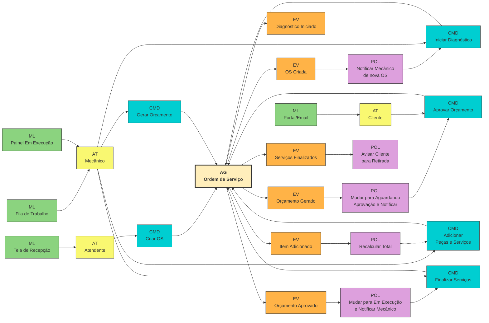
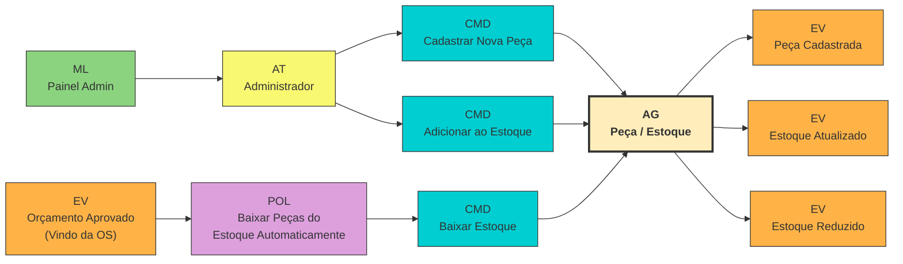

# Documentação DDD - Tech Challenge: Oficina Mecânica

Este documento compila a modelagem estratégica e tática do Domain-Driven Design (DDD) para o sistema da Oficina Mecânica, servindo de insumo para a ferramenta visual (Miro) e compondo a documentação exigida na Fase 1.

---

## 1. Linguagem Ubíqua (Ubiquitous Language)

A Linguagem Ubíqua garante que especialistas no domínio e desenvolvedores falem o mesmo idioma.

| Termo | Definição |
|---|---|
| **Cliente** | Pessoa (física ou jurídica) que contrata os serviços da oficina. |
| **Veículo** | O bem do Cliente que passará por diagnóstico e manutenção. |
| **Catálogo de Serviço** | A lista de tipos de manutenção oferecidos (ex: "Troca de Óleo", "Balanceamento"), contendo valores de mão de obra pré-definidos ou valor/hora. |
| **Peça / Insumo** | Itens materiais necessários para a execução dos serviços (ex: "Filtro de Óleo", "Pastilha de Freio"), que possuem custo e precisam ser retirados do estoque. |
| **Ordem de Serviço (OS)** | O registro principal do sistema. Associa um Cliente e seu Veículo a uma lista de Serviços solicitados, Diagnósticos, e Peças. |
| **Orçamento** | Composição do custo final da OS. É a soma do valor das Peças com o valor dos Serviços. Requer aprovação do Cliente. |
| **Mecânico / Operador** | Funcionário da oficina que realiza o diagnóstico e a execução dos serviços do veículo. |
| **Estoque** | Local virtual que controla a quantidade e movimentação de Peças/Insumos da oficina. |

### Status da Ordem de Serviço
- **Recebida:** O veículo deu entrada na oficina.
- **Em Diagnóstico:** O mecânico está analisando os problemas e listando serviços/peças necessárias.
- **Aguardando Aprovação:** O orçamento foi gerado e enviado ao cliente.
- **Em Execução:** Orçamento aprovado, serviços estão sendo realizados.
- **Finalizada:** Reparos concluídos, aguardando o cliente retirar o veículo.
- **Entregue:** Veículo devolvido ao cliente e ciclo encerrado.

---

## 2. Event Storming

Para transpor a modelagem para o Miro, adaptamos o Event Storming para o padrão visual focado em comandos e eventos reativos, utilizando a notação de **ML, AT, CMD, AG, EV e POL** conforme seu modelo de referência:

- 🟩 **ML (Read Model / Modelo de Leitura):** A tela ou visualização de dados que o usuário consulta (Verde).
- 🟨 **AT (Ator):** Quem executa a ação (Amarelo claro).
- 🟦 **CMD (Command):** Intenção de alterar o estado (Azul / Ciano).
- 🟨 **AG (Aggregate):** O bloco principal de domínio que processa o comando (Barra amarela grande).
- 🟧 **EV (Event):** Fato que ocorreu no sistema (Laranja).
- 🟪 **POL (Policy):** Política / Regra que reage a um evento para engatilhar um novo comando (Roxo).

### Fluxo 1: Criação e Acompanhamento da Ordem de Serviço (OS)

### Fluxo 2: Gestão de Peças e Insumos (Estoque)

---

## 3. Bounded Contexts (Contextos Delimitados)

A arquitetura do MVP será Monolítica, mas orientada a módulos que respeitam os Bounded Contexts. Esta estruturação facilitará a evolução para microsserviços no futuro, caso a oficina cresça.

1. **Contexto de Operação (Atendimento & Execução)**
   - Agregado Root: `OrdemDeServico`
   - Responsabilidades: Fazer o diagnóstico, gerenciar os status do serviço no veículo, calcular orçamentos e coletar a aprovação do cliente.

2. **Contexto de Estoque (Peças & Insumos)**
   - Agregado Root: `Peca`
   - Responsabilidades: Gerir a quantidade de itens em estoque, registrar movimentações (entradas/saídas) e garantir que a OS só possa ser executada se houver peças suficientes.

3. **Contexto Administrativo (Core Data)**
   - Agregado Root: `Cliente`, `Veiculo`, `ServicoCatalogo`
   - Responsabilidades: Manter os dados cadastrais atualizados e acessíveis para as Ordens de Serviço. Fornecer a base de valores de mão de obra para orçamentos.

## 4. Escolhas de Arquitetura de Software

- **Padrão:** Monólito Modular (Layered Architecture adaptada para Clean Architecture).
- **Justificativa do Monólito:** Para um MVP de uma oficina de médio porte, a complexidade de rede e orquestração de Microsserviços é prematura e adiciona *overhead* desnecessário de infraestrutura.
- **Banco de Dados:** PostgreSQL (Relacional).
  - *Justificativa:* O sistema lida fortemente com transações de estado (Ordem de Serviço, Estoque, Orçamento) e consistência ACID é fundamental (Ex: não podemos baixar o estoque de uma mesma peça duas vezes simultaneamente sem controle transacional seguro).
- **Segurança:** Autenticação via JWT (JSON Web Tokens) na camada de API.
- **Stack Definida:** Node.js com TypeScript (framework como NestJS recomendado por ter um contêiner de Injeção de Dependência maduro e facilitar arquitetura em camadas).

---
*Este documento atende as diretrizes do Tech Challenge e fornece o guia completo para desenhar no Miro e implementar no código.*
