# Fluxo de Criação e Acompanhamento de Ordem de Serviço

```mermaid
flowchart TD
    %% Criação da OS
    Start([Atendente cria OS]) --> POST_OS["POST /api/service-orders<br/>Body: customerId, vehicleId"]
    POST_OS --> ValidateCust{"Customer existe?<br/>(via ACL)"}
    ValidateCust -->|Não| Err404C["404 CustomerNotFoundException"]
    ValidateCust -->|Sim| ValidateVeh{"Vehicle existe?<br/>(via ACL)"}
    ValidateVeh -->|Não| Err404V["400 Vehicle not found"]
    ValidateVeh -->|Sim| ValidateOwner{"Vehicle.customerId<br/>== customerId?"}
    ValidateOwner -->|Não| Err400["400 Vehicle does not belong<br/>to the specified client"]
    ValidateOwner -->|Sim| CreateOS["Repository.create<br/>status = RECEIVED"]
    CreateOS --> RECEIVED(("RECEIVED"))

    %% Atribuir mecânico
    RECEIVED --> AssignMech["PATCH /api/service-orders/:id/mechanic<br/>Body: mechanicId"]
    AssignMech --> ValidateMech{"Mecânico existe e<br/>role = MECHANIC?"}
    ValidateMech -->|Não| Err404M["404 Mechanic not found"]
    ValidateMech -->|Sim| AssignOK["MechanicAssignment<br/>(OS continua RECEIVED)"]
    AssignOK --> StillReceived(("RECEIVED<br/>(com mecânico)"))

    %% Iniciar diagnóstico
    StillReceived --> StartDiag["PATCH /api/service-orders/:id/diagnosis"]
    StartDiag --> CanDiag{"Status == RECEIVED<br/>ou IN_DIAGNOSIS?"}
    CanDiag -->|Não| ErrDiag["400 InvalidStatusTransition"]
    CanDiag -->|Sim| DiagOK["status = IN_DIAGNOSIS"]
    DiagOK --> IN_DIAGNOSIS(("IN_DIAGNOSIS"))

    %% Criar orçamento
    IN_DIAGNOSIS --> CreateEst["POST /api/service-orders/:id/estimates"]
    CreateEst --> CanApprove{"Status == RECEIVED<br/>ou IN_DIAGNOSIS?"}
    CanApprove -->|Não| ErrApprove["400 InvalidStatusTransition"]
    CanApprove -->|Sim| EstOK["Estimate criado (PENDING, total=0)<br/>status = WAITING_APPROVAL"]
    EstOK --> WAITING(("WAITING_APPROVAL"))

    %% Adicionar itens ao orçamento
    WAITING --> AddItem["POST /api/service-orders/estimates/:eid/items<br/>Body: itemType, referenceId, quantity"]
    AddItem --> ItemType{"itemType?"}
    ItemType -->|SERVICE| FetchSvc["Buscar no SERVICE_CATALOG<br/>unitPrice = service.price"]
    ItemType -->|PART| FetchPart["Buscar em PART_REPOSITORY<br/>Validar estoque >= quantity<br/>Decrementar estoque"]
    FetchSvc --> CalcItem["Calcular totalPrice<br/>Recalcular totalAmount do estimate"]
    FetchPart --> CalcItem
    CalcItem --> StillWaiting(("WAITING_APPROVAL<br/>(com itens)"))

    %% Aprovar orçamento
    StillWaiting --> Approve["PATCH /api/service-orders/estimates/:eid/status<br/>Body: status = APPROVED"]
    Approve --> CanStart{"Status == WAITING_APPROVAL?"}
    CanStart -->|Não| ErrStart["400 InvalidStatusTransition"]
    CanStart -->|Sim| ApproveOK["Estimate = APPROVED<br/>status = IN_EXECUTION"]
    ApproveOK --> IN_EXECUTION(("IN_EXECUTION"))

    %% Rejeitar orçamento
    StillWaiting --> Reject["PATCH /api/service-orders/:id/reject"]
    Reject --> CanReject{"Status == WAITING_APPROVAL?"}
    CanReject -->|Não| ErrReject["400 InvalidStatusTransition"]
    CanReject -->|Sim| RejectOK["Restaurar peças ao estoque<br/>(incrementStock)<br/>status = IN_DIAGNOSIS"]
    RejectOK --> BackDiag(("IN_DIAGNOSIS"))
    BackDiag -.->|Novo orçamento| CreateEst

    %% Finalizar serviço
    IN_EXECUTION --> Finish["PATCH /api/service-orders/:id/finish<br/>Body: notes<br/>(req.user.userId == assignedMechanic)"]
    Finish --> CanFinish{"Status == IN_EXECUTION?<br/>User == mecânico assignado?"}
    CanFinish -->|Não| ErrFinish["400 InvalidStatusTransition<br/>ou 403 UnauthorizedMechanic"]
    CanFinish -->|Sim| FinishOK["status = FINISHED"]
    FinishOK --> FINISHED(("FINISHED"))

    %% Entregar veículo
    FINISHED --> Deliver["PATCH /api/service-orders/:id/deliver"]
    Deliver --> CanDeliver{"Status == FINISHED?"}
    CanDeliver -->|Não| ErrDeliver["400 InvalidStatusTransition"]
    CanDeliver -->|Sim| DeliverOK["status = DELIVERED"]
    DeliverOK --> DELIVERED(("DELIVERED"))

    %% Encerrar OS
    DELIVERED --> Close["PATCH /api/service-orders/:id/close"]
    Close --> CanClose{"Status == DELIVERED?"}
    CanClose -->|Não| ErrClose["400 InvalidStatusTransition"]
    CanClose -->|Sim| CloseOK["status = CLOSED"]
    CloseOK --> CLOSED(("CLOSED<br/>(estado terminal)"))

    %% Consultas (em qualquer estado)
    AnyState["GET /api/service-orders<br/>GET /api/service-orders/:id<br/>GET /api/service-orders/metrics/average-time"]
    RECEIVED -.-> AnyState
    AnyState -.-> CONSULTA["Consulta / Acompanhamento<br/>(JWT obrigatório)"]

    %% Estilos
    style RECEIVED fill:#4CAF50,color:#fff
    style IN_DIAGNOSIS fill:#2196F3,color:#fff
    style WAITING fill:#FF9800,color:#fff
    style IN_EXECUTION fill:#9C27B0,color:#fff
    style FINISHED fill:#607D8B,color:#fff
    style DELIVERED fill:#795548,color:#fff
    style CLOSED fill:#333,color:#fff
    style Err404C fill:#f44336,color:#fff
    style Err404V fill:#f44336,color:#fff
    style Err400 fill:#f44336,color:#fff
    style Err404M fill:#f44336,color:#fff
    style ErrDiag fill:#f44336,color:#fff
    style ErrApprove fill:#f44336,color:#fff
    style ErrStart fill:#f44336,color:#fff
    style ErrReject fill:#f44336,color:#fff
    style ErrFinish fill:#f44336,color:#fff
    style ErrDeliver fill:#f44336,color:#fff
    style ErrClose fill:#f44336,color:#fff
```



## Legenda

| Cor | Significado |
|-----|-------------|
| 🟢 Verde | RECEIVED — OS criada, aguardando atribuição |
| 🔵 Azul | IN_DIAGNOSIS — Mecânico diagnosticando o veículo |
| 🟠 Laranja | WAITING_APPROVAL — Orçamento enviado, aguardando cliente |
| 🟣 Roxo | IN_EXECUTION — Serviço em andamento |
| 🔘 Cinza-azulado | FINISHED — Serviço concluído pelo mecânico |
| 🟤 Marrom | DELIVERED — Veículo entregue ao cliente |
| ⚫ Preto | CLOSED — OS encerrada (estado terminal) |
| 🔴 Vermelho | Erro (4xx) — Transição inválida ou recurso não encontrado |

## Endpoints do ciclo

| Etapa | Método | Endpoint | Guard |
|-------|--------|----------|-------|
| Criar OS | `POST` | `/api/service-orders` | JwtAuthGuard |
| Atribuir mecânico | `PATCH` | `/api/service-orders/:id/mechanic` | JwtAuthGuard |
| Iniciar diagnóstico | `PATCH` | `/api/service-orders/:id/diagnosis` | JwtAuthGuard |
| Criar orçamento | `POST` | `/api/service-orders/:id/estimates` | JwtAuthGuard |
| Adicionar item | `POST` | `/api/service-orders/estimates/:eid/items` | JwtAuthGuard |
| Aprovar orçamento | `PATCH` | `/api/service-orders/estimates/:eid/status` | JwtAuthGuard |
| Rejeitar orçamento | `PATCH` | `/api/service-orders/:id/reject` | JwtAuthGuard |
| Iniciar serviço | `PATCH` | `/api/service-orders/:id/start-service` | JwtAuthGuard |
| Finalizar serviço | `PATCH` | `/api/service-orders/:id/finish` | JwtAuthGuard |
| Entregar veículo | `PATCH` | `/api/service-orders/:id/deliver` | JwtAuthGuard |
| Encerrar OS | `PATCH` | `/api/service-orders/:id/close` | JwtAuthGuard |
| Listar OS | `GET` | `/api/service-orders` | JwtAuthGuard |
| Detalhar OS | `GET` | `/api/service-orders/:id` | — |
| Tempo médio | `GET` | `/api/service-orders/metrics/average-time` | JwtAuthGuard |
```
