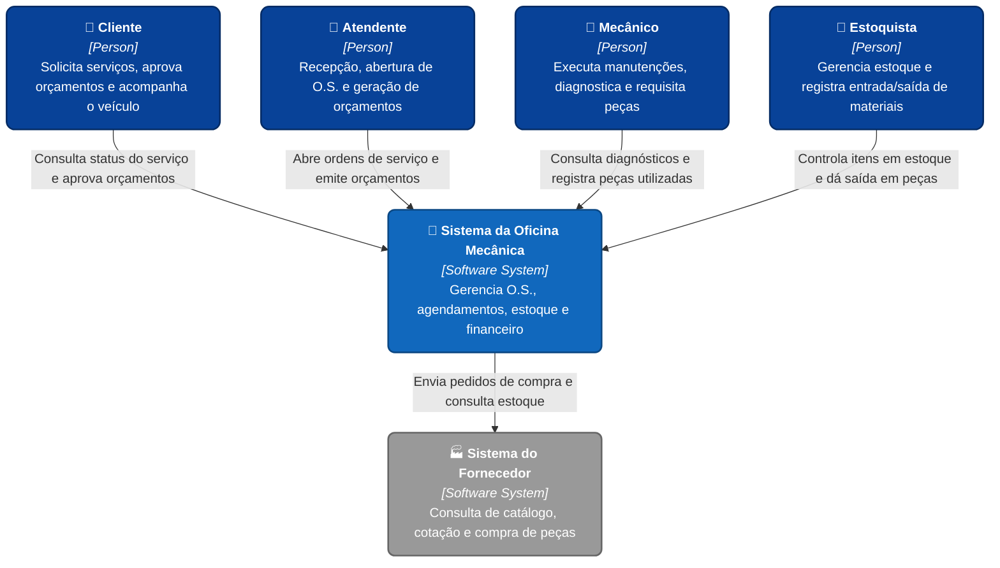
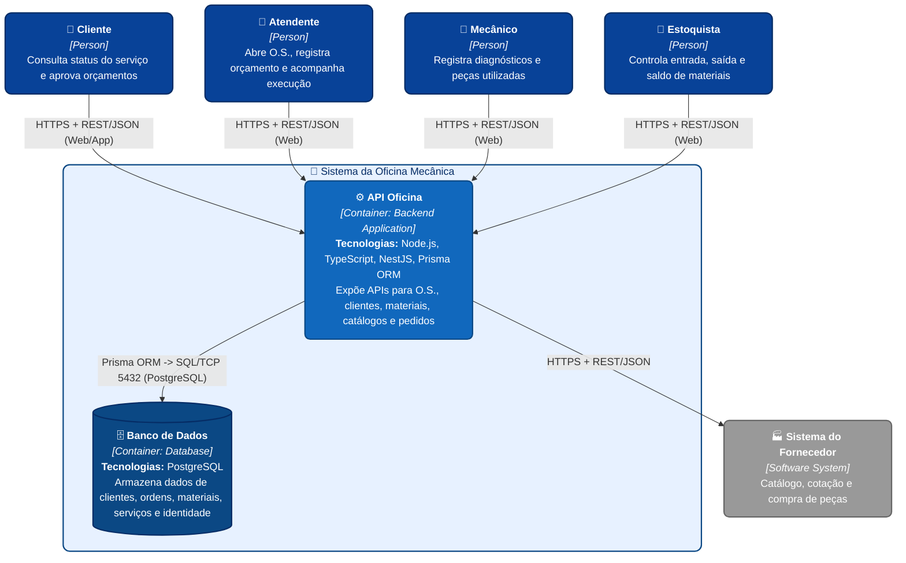
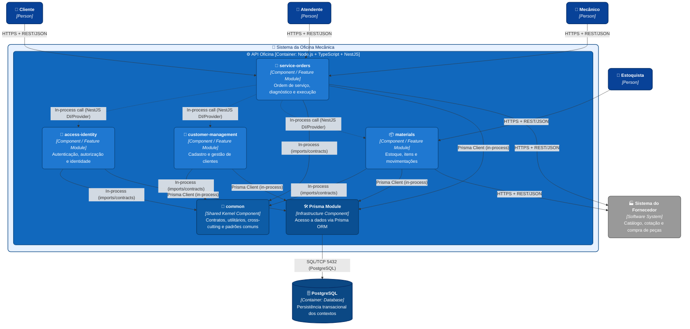

# C4 Model - Sistema da Oficina Mecânica

Este documento reúne os diagramas C4 em Mermaid para visualização direta no GitHub.

Arquivos-fonte:

- [context.mmd](context.mmd)
- [api-oficina-container.mmd](api-oficina-container.mmd)
- [api-oficina-components.mmd](api-oficina-components.mmd)

## Nível 1 - Contexto

## Nível 2 - Container

## Nível 3 - Components

